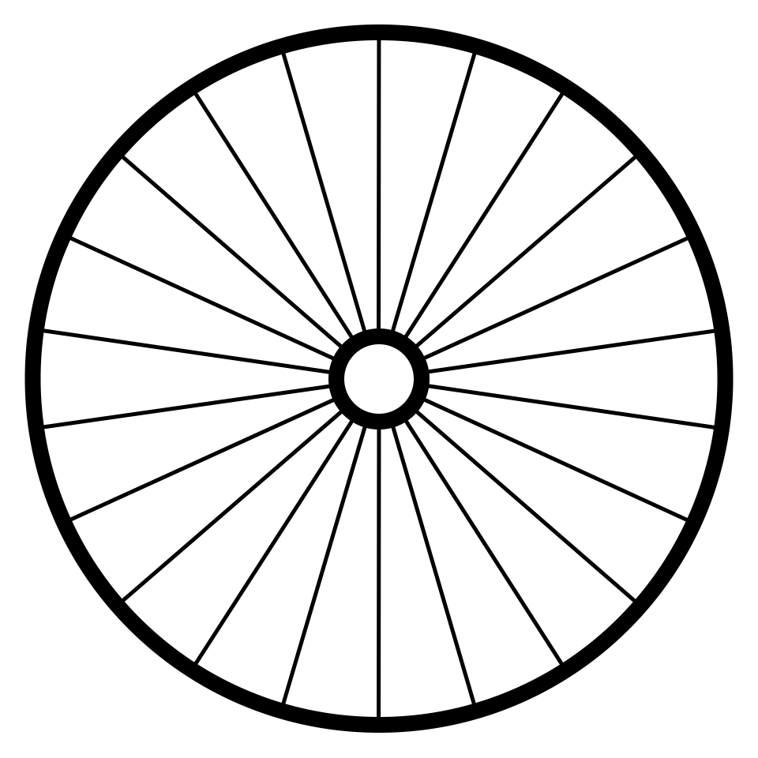
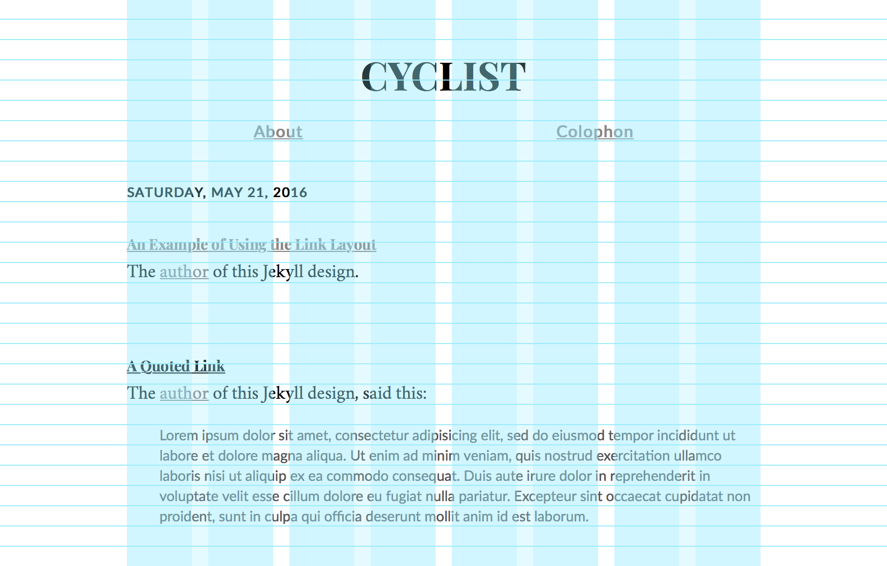
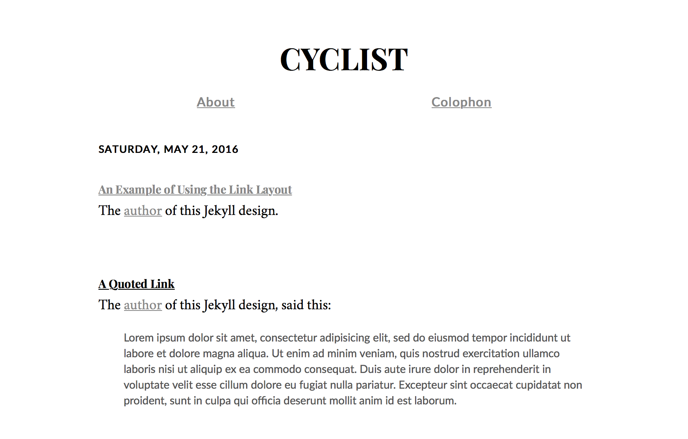

# Cyclist Jekyll



Cyclist Jekyll is a Jekyll theme. It uses [Cyclist Grid](https://github.com/cyclist-grid/cyclist-grid) to construct a layout using typographic grid.

The typefaces are [Playfair Display][playfair] for headers, [Crimson][crimson] for body copy, [Lato][lato] for block quotes, and [Fira Mono][fira] for code. All of them are free software under the [SIL Open Font License](https://en.wikipedia.org/wiki/SIL_Open_Font_License). Thank you for everyone's hard work on free typography.

[playfair]: https://github.com/clauseggers/Playfair-Display "Playfair Display"
[lato]: https://github.com/betsol/lato-font "Lato"
[crimson]: https://github.com/skosch/Crimson "Crimson"
[fira]: https://github.com/mozilla/Fira "Fira"





## Customization

### Using Custom SCSS

Add a `assets/main.scss` to your Jekyll directory with the following contents:

    $font-size: 15px;
    $line-height: 22px;

    @import "{{ site.theme }}";

    // Your SCSS rules here

### Using a Custom Font

1. Add an `assets/main.scss` to your Jekyll directory, as described in [Using Custom SCSS](#using-custom-scss)
2. Add `@import "typography";` after `@import "{{ site.theme }}";` to the `_assets/main.scss` in your Jekyll directory
3. Copy `_sass/typography.scss` from this repository to the same path in your Jekyll directory, and edit the font styles. (If you want to remove a style in `typography.scss` to set it to the CSS default, do not delete it, instead, use `unset` like `font-size: unset;`. This is because the original `typography.scss` is still also loaded, and the `_sass/typography.scss` in your Jekyll directory is then applied on top.)
4. Copy `_includes/head.html` from this repository to the same path in your Jekyll directory, and change the Google font `link` tag to reference the new fonts

### Using a Header Image

1. Copy `_includes/header.html` from this repository to the same path in your Jekyll directory.
2. In the `header.html` in your Jekyll diectory, replace the contents of the `header role="banner" > H1 > a` with an `img`:

        <header role="banner">
          <h1>
            <a href="{{ "/" | relative_url }}"></a>
          </h1>

3. Add an `assets/main.scss` to your Jekyll directory, as described in [Using Custom SCSS](#using-custom-scss), and add the following styles:

        header[role="banner"] img {
          display: block;
        }

        header[role="banner"] h1 a {
          display: inline-block;
          line-height: normal;
        }

        header[role="banner"] h1 {
          line-height: 0;
          margin-bottom: $line-height;
        }

## Cyclist Grid

To show the grid, import the `cyclist-grid.js` JavaScript in the [HTML `<head>`](_includes/head.html) element:

	<script src="/vendor/cyclist-grid/dist/js/cyclist-grid.js"></script>

Add the following classes to the [`<body>` and grid `<div>` elements](_layouts/default.html):

	<body class="cyclist-show-baseline">
	  <div id="grid" class="cyclist-show-guidelines">

## Installation

Add this line to your Jekyll site's `Gemfile`:

```ruby
gem "cyclist"
```
And add this line to your Jekyll site's `_config.yml`: ```yaml theme: cyclist ```

And then execute:

    $ bundle

Or install it yourself as:

    $ gem install cyclist

## License

The theme is available as open source under the terms of the [MIT License](https://opensource.org/licenses/MIT).

