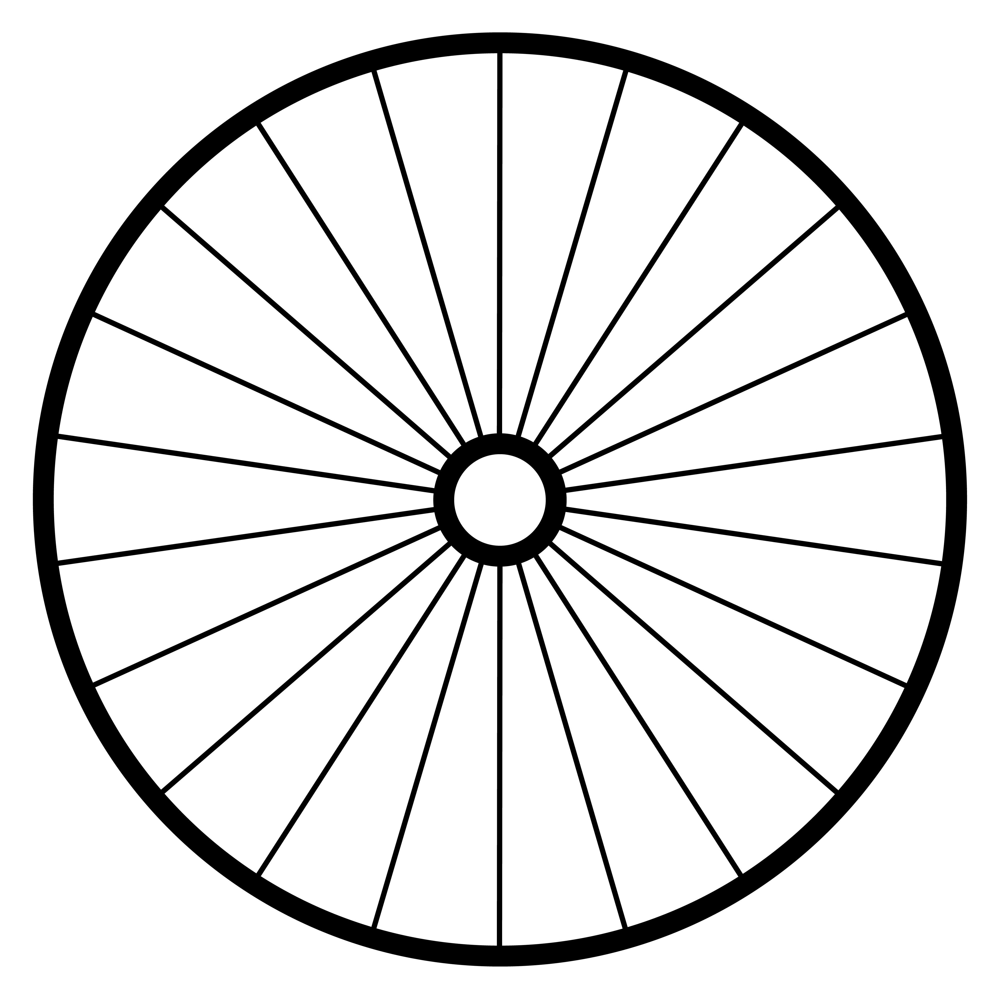

# Cyclist

Cyclist is a Jekyll theme. It uses [Raster](https://github.com/robenkleene/raster) to construct a layout using typographic grid.

The typefaces are [Playfair Display][playfair] for headers, [Crimson][crimson] for body copy, [Lato][lato] for block quotes, and [Fira Mono][fira] for code. All of them are free software under the [SIL Open Font License](https://en.wikipedia.org/wiki/SIL_Open_Font_License). Thank you for everyone's hard work on free typography.

[playfair]: https://github.com/clauseggers/Playfair-Display "Playfair Display"
[lato]: https://github.com/betsol/lato-font "Lato"
[crimson]: https://github.com/skosch/Crimson "Crimson"
[fira]: https://github.com/mozilla/Fira "Fira"




## Raster

To show the raster grid, import the `raster.js` JavaScript in the [HTML `<head>`](_includes/head.html) element:

	<script src="/vendor/raster/dist/js/raster.js"></script>

Add the following classes to the [`<body>` and grid `<div>` elements](_layouts/default.html):

	<body class="raster-show-baseline">
	  <div id="grid" class="raster-show-guidelines">

## Installation

Add this line to your Jekyll site's `Gemfile`:

```ruby
gem "cyclist"
```

And add this line to your Jekyll site's `_config.yml`:

```yaml
theme: cyclist
```

And then execute:

    $ bundle

Or install it yourself as:

    $ gem install cyclist

## License

The theme is available as open source under the terms of the [MIT License](https://opensource.org/licenses/MIT).

